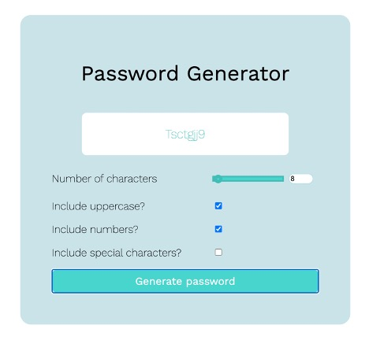
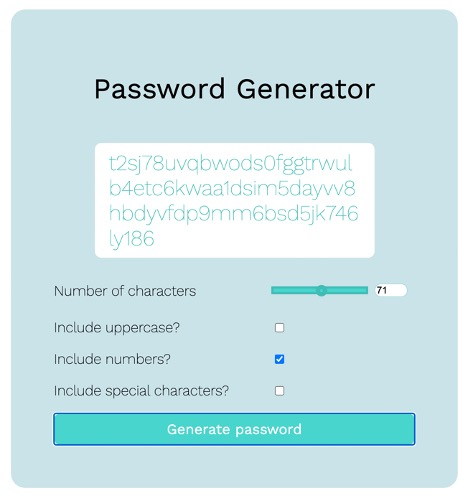

# Password Generator Project

## Description

As our third homework assignment, we were asked to create create an application an employee could use to generate a random password, based on specified criteria. 

The app must meet the following requirements:
*Feature dynamically updated HTML and CSS powered by JavaScript
*Have a clean, polished, responsive user interface
*Prompt the user to select password criteria
*Offer the option to use special characters
*Allow prompts for other password criteria, including numbers and uppercase letters
*Have a length of at least 8 but no more than 128 characters
*Require that the user select at least one character type 
*Input validation
*Display in an alert or on screen.

Height of window expands to fit longer passwords.

## Credits

Credit is due to the following: 
*Our fabulous Columbia University Boot Camp instructor, teaching assistants, and staff
*My tutor, Alyssa Schmalenberger
*Our amazing little "We Got This!" study group (#study-group-1")!
*ASCII character conversion table, courtesy Wikimedia.
*Google Fonts: "Work Sans" font.
*"Build a Password Generator" tutorial by WebDevSimplified 

## License

Copyright (c) 2020, Melissa Kinsey

Permission is hereby granted, free of charge, to any person obtaining a copy
of this software and associated documentation files (the "Software"), to deal
in the Software without restriction, including without limitation the rights
to use, copy, modify, merge, publish, distribute, sublicense, and/or sell
copies of the Software, and to permit persons to whom the Software is
furnished to do so, subject to the following conditions:

The above copyright notice and this permission notice shall be included in all
copies or substantial portions of the Software.

THE SOFTWARE IS PROVIDED "AS IS", WITHOUT WARRANTY OF ANY KIND, EXPRESS OR
IMPLIED, INCLUDING BUT NOT LIMITED TO THE WARRANTIES OF MERCHANTABILITY,
FITNESS FOR A PARTICULAR PURPOSE AND NONINFRINGEMENT. IN NO EVENT SHALL THE
AUTHORS OR COPYRIGHT HOLDERS BE LIABLE FOR ANY CLAIM, DAMAGES OR OTHER
LIABILITY, WHETHER IN AN ACTION OF CONTRACT, TORT OR OTHERWISE, ARISING FROM,
OUT OF OR IN CONNECTION WITH THE SOFTWARE OR THE USE OR OTHER DEALINGS IN THE
SOFTWARE.
